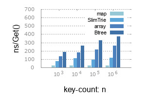
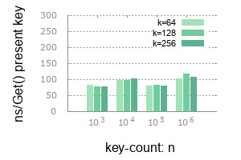

<!--
based on the a great readme template
https://gist.github.com/PurpleBooth/109311bb0361f32d87a2
-->

# Slim - surprisingly space efficient data types in Golang

[](https://travis-ci.com/openacid/slim)


[](https://goreportcard.com/report/github.com/openacid/slim)
[](https://coveralls.io/github/openacid/slim?branch=main&service=github)

[](http://godoc.org/github.com/openacid/slim)
[](https://pkg.go.dev/github.com/openacid/slim)
[](https://sourcegraph.com/github.com/openacid/slim?badge)

Slim is collection of surprisingly space efficient data types, with
corresponding serialization APIs to persisting them on-disk or for transport.

<!-- START doctoc generated TOC please keep comment here to allow auto update -->
<!-- DON'T EDIT THIS SECTION, INSTEAD RE-RUN doctoc TO UPDATE -->


- [Why slim](#why-slim)
- [Memory overhead](#memory-overhead)
- [Performance](#performance)
- [False Positive Rate](#false-positive-rate)
- [Status](#status)
- [Roadmap](#roadmap)
- [Change-log](#change-log)
- [Synopsis](#synopsis)
  - [Index keys, get by key](#index-keys-get-by-key)
  - [Index key ranges, get by key](#index-key-ranges-get-by-key)
  - [Scan](#scan)
- [Getting started](#getting-started)
- [Who are using slim](#who-are-using-slim)
- [Feedback and contributions](#feedback-and-contributions)
- [Authors](#authors)
- [License](#license)

<!-- END doctoc generated TOC please keep comment here to allow auto update -->

## Why slim

As data on internet keeps increasing exponentially,
the capacity gap between memory and disk becomes greater.

Most of the time, a data itself does not need to be loaded into expensive main memory.
Only the much more important information, WHERE-A-DATA-IS, deserve a seat in
main memory.

This is what `slim` does, keeps as little information as possible in main
memory, as a minimized index of huge amount external data.

-   `SlimIndex`: is a common index structure, building on top of `SlimTrie`.

    [](http://godoc.org/github.com/openacid/slim/index)

-   `SlimTrie` is the underlying index data structure, evolved from [trie][].

    [](http://godoc.org/github.com/openacid/slim/trie)

    **Features**:

    -   **Minimized**:
        **11 bits per key**(far less than an 64-bits pointer!!).

    -   **Stable**:
        memory consumption is stable in various scenarios.
        The Worst case converges to average consumption tightly.
        See benchmark.

    -   **Loooong keys**:
        You can have **VERY** long keys(`16K bytes`), without any waste of memory(and money).
        Do not waste your life writing another prefix compression`:)`.
        ([aws-s3][] limits key length to 1024 bytes).
        Memory consumption only relates to key count, **not to key length**.

    -   **Ordered**:
        like [btree][], keys are stored.
        Range-scan will be ready in `0.6.0`.

    -   **Fast**:
        **~100 ns** per `Get()`.
        Time complexity for a get is `O(log(n) + k); n: key count; k: key length`.

    -   **Ready for transport**:
        a single `proto.Marshal()` is all it requires to serialize, transport or persisting on disk etc.


## Memory overhead

-   Random string, fixed length, default mode, no label is store if possible:

    **Bits/key**: memory or disk-space in bits a key consumed in average.
    It does not change when key-length(`k`) becomes larger!

    


-   1 million var-length string, 10 to 20 byte in different mode SlimTrie:

    | -          | size  | gzip-size |
    | :--        | --:   | --:       |
    | Original   | 15.0M | 14.0M     |
    | Complete   | 14.0M | 10.0M     |
    | InnerLabel |  1.3M |  0.9M     |
    | NoLabel    |  1.3M |  0.8M     |

    Raw string list and serialized slim is stored in:
    https://github.com/openacid/testkeys/tree/master/assets

    -   Original: raw string lines in a text file.

    -   Complete: `NewSlimTrie(..., Opt{Complete:Bool(true)})`: lossless SlimTrie,
        stores complete info of every string. This mode provides accurate query.

    -   InnerLabel: `NewSlimTrie(..., Opt{InnerPrefix:Bool(true)})` SlimTrie stores
        only label strings of inner nodes(but not label to a leaf). There is false positive in this mode.

    -   NoLabel: No label info is stored. False positive rate is higher.


## Performance

Time(in nano second) spent on a `Get()` with golang-map, SlimTrie, array and [btree][] by google.

- **3.3 times faster** than the [btree][].
- **2.3 times faster** than binary search.




Time(in nano second) spent on a `Get()` with different key count(`n`) and key length(`k`):




## False Positive Rate


> Bloom filter requires about 9 bits/key to archieve less than 1% FPR.

See: [trie/report/](trie/report/)


## Status

-   `SlimTrie` APIs are stable, and has been used in a production env.

    Meanwhile we focus on optimizing memory usage and query performance.

-   Internal data structure are promised to be backward compatible for ever.
    No data migration issue!


## Roadmap

-   [x] **2021-01-15** v0.5.11 Query by range
-   [x] **2019-09-18** v0.5.10 Reduce false positive rate to less than 0.05%
-   [x] **2019-06-03** v0.5.9  Large key set benchmark
-   [x] **2019-05-29** v0.5.6  Support up to 2 billion keys
-   [x] **2019-05-18** v0.5.4  Reduce memory usage from 40 to 14 bits/key
-   [x] **2019-04-20** v0.4.3  Range index: many keys share one index item
-   [x] **2019-04-18** v0.4.1  Marshaling support
-   [x] **2019-03-08** v0.1.0  SlimIndex SlimTrie

## Change-log

[Change-log](docs/change-log.yaml)

## Synopsis

### Index keys, get by key

```go
package index_test

import (
	"fmt"
	"strings"

	"github.com/openacid/slim/index"
)

type Data string

func (d Data) Read(offset int64, key string) (string, bool) {
	kv := strings.Split(string(d)[offset:], ",")[0:2]
	if kv[0] == key {
		return kv[1], true
	}
	return "", false
}

func Example() {

	// Accelerate external data accessing (in memory or on disk) by indexing
	// them with a SlimTrie:

	// `data` is a sample of some unindexed data. In our example it is a comma
	// separated key value series.
	//
	// In order to let SlimTrie be able to read data, `data` should have
	// a `Read` method:
	//     Read(offset int64, key string) (string, bool)
	data := Data("Aaron,1,Agatha,1,Al,2,Albert,3,Alexander,5,Alison,8")

	// keyOffsets is a prebuilt index that stores key and its offset in data accordingly.
	keyOffsets := []index.OffsetIndexItem{
		{Key: "Aaron", Offset: 0},
		{Key: "Agatha", Offset: 8},
		{Key: "Al", Offset: 17},
		{Key: "Albert", Offset: 22},
		{Key: "Alexander", Offset: 31},
		{Key: "Alison", Offset: 43},
	}

	// `SlimIndex` is simply a container of SlimTrie and its data.
	st, err := index.NewSlimIndex(keyOffsets, data)
	if err != nil {
		fmt.Println(err)
	}

	// Lookup
	v, found := st.Get("Alison")
	fmt.Printf("key: %q\n  found: %t\n  value: %q\n", "Alison", found, v)

	v, found = st.Get("foo")
	fmt.Printf("key: %q\n  found: %t\n  value: %q\n", "foo", found, v)

	// Output:
	// key: "Alison"
	//   found: true
	//   value: "8"
	// key: "foo"
	//   found: false
	//   value: ""
}
```

### Index key ranges, get by key

Create an index item for every 4(or more as you wish) keys.

Let several adjacent keys share one index item reduces a lot memory
cost if there are huge amount keys in external data.
Such as to index billions of 4KB objects on a 4TB disk(because one disk IO
costs 20ms for either reading 4KB or reading 1MB).

```go
package index_test

import (
	"fmt"
	"strings"

	"github.com/openacid/slim/index"
)

type RangeData string

func (d RangeData) Read(offset int64, key string) (string, bool) {
	for i := 0; i < 4; i++ {
		if int(offset) >= len(d) {
			break
		}

		kv := strings.Split(string(d)[offset:], ",")[0:2]
		if kv[0] == key {
			return kv[1], true
		}
		offset += int64(len(kv[0]) + len(kv[1]) + 2)

	}
	return "", false
}

func Example_indexRanges() {

	// Index ranges instead of keys:
	// In this example at most 4 keys shares one index item.

	data := RangeData("Aaron,1,Agatha,1,Al,2,Albert,3,Alexander,5,Alison,8")

	// keyOffsets is a prebuilt index that stores range start, range end and its offset.
	keyOffsets := []index.OffsetIndexItem{
		// Aaron  +--> 0
		// Agatha |
		// Al     |
		// Albert |

		// Alexander +--> 31
		// Alison    |

		{Key: "Aaron", Offset: 0},
		{Key: "Agatha", Offset: 0},
		{Key: "Al", Offset: 0},
		{Key: "Albert", Offset: 0},

		{Key: "Alexander", Offset: 31},
		{Key: "Alison", Offset: 31},
	}

	st, err := index.NewSlimIndex(keyOffsets, data)
	if err != nil {
		panic(err)
	}

	v, found := st.RangeGet("Aaron")
	fmt.Printf("key: %q\n  found: %t\n  value: %q\n", "Aaron", found, v)

	v, found = st.RangeGet("Al")
	fmt.Printf("key: %q\n  found: %t\n  value: %q\n", "Al", found, v)

	v, found = st.RangeGet("foo")
	fmt.Printf("key: %q\n  found: %t\n  value: %q\n", "foo", found, v)

	// Output:
	// key: "Aaron"
	//   found: true
	//   value: "1"
	// key: "Al"
	//   found: true
	//   value: "2"
	// key: "foo"
	//   found: false
	//   value: ""
}
```


### Scan


```go
package trie

import (
	"fmt"

	"github.com/openacid/slim/encode"
)

func ExampleSlimTrie_ScanFrom() {
	var keys = []string{
		"",
		"`",
		"a",
		"ab",
		"abc",
		"abca",
		"abcd",
		"abcd1",
		"abce",
		"be",
		"c",
		"cde0",
		"d",
	}
	values := makeI32s(len(keys))

	codec := encode.I32{}
	st, _ := NewSlimTrie(codec, keys, values, Opt{
		Complete: Bool(true),
	})

	// untilD stops when encountering "d".
	untilD := func(k, v []byte) bool {
		if string(k) == "d" {
			return false
		}

		_, i32 := codec.Decode(v)
		fmt.Println(string(k), i32)
		return true
	}

	fmt.Println("scan (ab, +∞):")
	st.ScanFrom("ab", false, true, untilD)

	fmt.Println()
	fmt.Println("scan [be, +∞):")
	st.ScanFrom("be", true, true, untilD)

	fmt.Println()
	fmt.Println("scan (ab, be):")
	st.ScanFromTo(
		"ab", false,
		"be", false,
		true, untilD)

	// Output:
	//
	// scan (ab, +∞):
	// abc 4
	// abca 5
	// abcd 6
	// abcd1 7
	// abce 8
	// be 9
	// c 10
	// cde0 11
	//
	// scan [be, +∞):
	// be 9
	// c 10
	// cde0 11
	//
	// scan (ab, be):
	// abc 4
	// abca 5
	// abcd 6
	// abcd1 7
	// abce 8
}
```

<!-- ## FAQ -->

## Getting started

**Install**

```sh
go get github.com/openacid/slim/trie
```


<!-- TODO add FAQ -->
<!-- TODO add serialization explanation, on-disk data structure etc. -->

## Who are using slim

<span> <span> ![][baishancloud-favicon] </span> <span> [baishancloud][] </span> </span>

<!-- ## Slim internal -->

<!-- ### Built With -->

<!-- - [protobuf][] - Define on-disk data-structure and serialization engine. -->
<!-- - [dep][] - Dependency Management. -->
<!-- - [semver][] - For versioning data-structure. -->

<!-- ### Directory Layout -->

<!-- We follow the: [golang-standards-project-layout][]. -->

<!-- [> TODO read the doc and add more standards <] -->

<!-- -   `vendor/`: dependency packages. -->
<!-- -   `prototype/`: on-disk data-structure. -->
<!-- -   `docs/`: documents about design, trade-off, etc -->
<!-- -   `tools/`: documents about design, trade-off, etc -->
<!-- -   `expamples/`: documents about design, trade-off, etc -->

<!-- Other directories are sub-package. -->


<!-- ### Versioning -->

<!-- We use [SemVer](http://semver.org/) for versioning. -->

<!-- For the versions available, see the [tags on this repository](https://github.com/your/project/tags).  -->

<!-- ### Data structure explained -->
<!-- [> TODO  <] -->

<!-- ## Limitation -->
<!-- [> TODO  <] -->


<!-- -   [ ] bitrie: 1 byte-per-key implementation. -->
<!-- -   [ ] balanced bitrie: which gives better worst-case performance. -->
<!-- -   [ ] generalised API as a drop-in replacement for map etc. -->


## Feedback and contributions

**Feedback and Contributions are greatly appreciated**.

At this stage, the maintainers are most interested in feedback centered on:

-   Do you have a real life scenario that `slim` supports well, or doesn't support at all?
-   Do any of the APIs fulfill your needs well?

Let us know by filing an issue, describing what you did or wanted to do, what
you expected to happen, and what actually happened:

-   [bug-report][]
-   [improve-document][]
-   [feature-request][]

Or other type of [issue][new-issue].

<!-- ## Contributing -->
<!-- The maintainers actively manage the issues list, and try to highlight issues -->
<!-- suitable for newcomers. -->

<!-- [> TODO dep CONTRIBUTING <] -->
<!-- The project follows the typical GitHub pull request model. See CONTRIBUTING.md for more details. -->

<!-- Before starting any work, please either comment on an existing issue, -->
<!-- or file a new one. -->

<!-- [> TODO  <] -->
<!-- Please read [CONTRIBUTING.md][] -->
<!-- for details on our code of conduct, and the process for submitting pull requests to us. -->
<!-- https://gist.github.com/PurpleBooth/b24679402957c63ec426 -->


<!-- ### Code style -->

<!-- ### Tool chain -->

<!-- ### Customized install -->

<!-- Alternatively, if you have a customized go develop environment, you could also -->
<!-- clone it: -->

<!-- ```sh -->
<!-- git clone git@github.com:openacid/slim.git -->
<!-- ``` -->

<!-- As a final step you'd like have a test to see if everything goes well: -->

<!-- ```sh -->
<!-- cd path/to/slim/build/pseudo-gopath -->
<!-- export GOPATH=$(pwd) -->
<!-- go test github.com/openacid/slim/array -->
<!-- ``` -->

<!-- Another reason to have a `pseudo-gopath` in it is that some tool have their -->
<!-- own way conducting source code tree. -->
<!-- E.g. [git-worktree](https://git-scm.com/docs/git-worktree) -->
<!-- checkouts source code into another dir other than the GOPATH work space. -->

<!-- ## Update dependency -->

<!-- Dependencies are tracked by [dep](https://github.com/golang/dep). -->
<!-- All dependencies are kept in `vendor/` dir thus you do not need to do anything -->
<!-- to run it. -->

<!-- You need to update dependency only when you bring in new feature with other dependency. -->

<!-- -   Install `dep` -->

<!--     ``` -->
<!--     curl https://raw.githubusercontent.com/golang/dep/master/install.sh | sh -->
<!--     ``` -->

<!-- -   Download dependency -->

<!--     ``` -->
<!--     dep ensure -->
<!--     ``` -->

<!--     > dep uses Gopkg.toml Gopkg.lock to track dependency info. -->
<!--     >  -->
<!--     > Gopkg.toml Gopkg.lock is created with `dep init`. -->
<!--     > -->
<!--     > dep creates a `vendor` dir to have all dependency package there. -->

<!-- See more: [dep-install][] -->


## Authors

<!-- ordered by unicode of author's name -->
<!-- leave 3 to 5 major jobs you have done in this project -->

- ![][刘保海-img-sml] **[刘保海][]** *marshaling*
- ![][吴义谱-img-sml] **[吴义谱][]** *array*
- ![][张炎泼-img-sml] **[张炎泼][]** *slimtrie design*
- ![][李文博-img-sml] **[李文博][]** *trie-compressing, trie-search*
- ![][李树龙-img-sml] **[李树龙][]** *marshaling*


See also the list of [contributors][] who participated in this project.


## License

This project is licensed under the MIT License - see the [LICENSE](LICENSE) file for details.

<!-- ## Acknowledgments -->

<!-- [> TODO  <] -->
<!-- - Hat tip to anyone whose code was used -->

<!-- - Inspiration -->
<!--     patricial tree -->
<!--     fusion tree -->
<!--     critic trie -->
<!-- - etc -->

<!-- links -->

<!-- Bio -->

[刘保海]: https://github.com/liubaohai
[吴义谱]: https://github.com/pengsven
[张炎泼]: https://github.com/drmingdrmer
[李文博]: https://github.com/wenbobuaa
[李树龙]: https://github.com/lishulong

<!-- avatar -->

[刘保海-img-sml]: https://avatars1.githubusercontent.com/u/26271283?s=36&v=4
[吴义谱-img-sml]: https://avatars3.githubusercontent.com/u/6927668?s=36&v=4
[张炎泼-img-sml]: https://avatars3.githubusercontent.com/u/44069?s=36&v=4
[李文博-img-sml]: https://avatars1.githubusercontent.com/u/11748387?s=36&v=4
[李树龙-img-sml]: https://avatars2.githubusercontent.com/u/13903162?s=36&v=4

[contributors]: https://github.com/openacid/slim/contributors

[dep]: https://github.com/golang/dep
[protobuf]: https://github.com/protocolbuffers/protobuf
[semver]: http://semver.org/

[protoc-install]: http://google.github.io/proto-lens/installing-protoc.html
[dep-install]: https://github.com/golang/dep#installation

[CONTRIBUTING.md]: CONTRIBUTING.md

[baishancloud]: http://www.baishancdnx.com
[baishancloud-favicon]: http://www.baishancdnx.com/public/favicon.ico
[golang-standards-project-layout]: https://github.com/golang-standards/project-layout

<!-- issue links -->

[bug-report]:       https://github.com/openacid/slim/issues/new?labels=bug&template=bug_report.md
[improve-document]: https://github.com/openacid/slim/issues/new?labels=doc&template=doc_improve.md
[feature-request]:  https://github.com/openacid/slim/issues/new?labels=feature&template=feature_request.md

[new-issue]: https://github.com/openacid/slim/issues/new/choose

<!-- benchmark -->

[benchmark-get-png]: docs/trie/charts/bench_get_2019_06_03.png

<!-- links to other resource -->

<!-- reference -->

[trie]: https://en.wikipedia.org/wiki/Trie
[btree]: https://github.com/google/btree
[aws-s3]: https://aws.amazon.com/s3/
[red-black-tree]: https://en.wikipedia.org/wiki/Red%E2%80%93black_tree