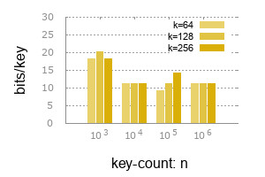

<!--
based on the a great readme template
https://gist.github.com/PurpleBooth/109311bb0361f32d87a2
-->

# Slim - surprisingly space efficient data types in Golang

[](https://travis-ci.org/openacid/slim)
[](https://ci.appveyor.com/project/drmingdrmer/slim/branch/master)
[](http://godoc.org/github.com/openacid/slim)
[](https://goreportcard.com/report/github.com/openacid/slim)
[](https://golangci.com/r/github.com/openacid/slim)
[](https://sourcegraph.com/github.com/openacid/slim?badge)


Slim is collection of surprisingly space efficient data types, with
corresponding serialization APIs to persisting them on-disk or for transport.

<!-- START doctoc generated TOC please keep comment here to allow auto update -->
<!-- DON'T EDIT THIS SECTION, INSTEAD RE-RUN doctoc TO UPDATE -->


- [Why slim](#why-slim)
- [Memory overhead](#memory-overhead)
- [Performance benchmark](#performance-benchmark)
- [Status, Roadmap and Change-log](#status-roadmap-and-change-log)
- [Synopsis](#synopsis)
  - [Index keys, get by key](#index-keys-get-by-key)
  - [Index key ranges, get by key](#index-key-ranges-get-by-key)
- [Getting started](#getting-started)
- [Who are using slim](#who-are-using-slim)
- [Feedback and contributions](#feedback-and-contributions)
- [Authors](#authors)
- [License](#license)

<!-- END doctoc generated TOC please keep comment here to allow auto update -->

## Why slim

As data on internet keeps increasing exponentially,
the capacity gap between memory and disk becomes greater.

Most of the time, a data itself does not need to be loaded into expensive main memory.
Only the much more important information, WHERE-A-DATA-IS, deserve a seat in
main memory.

This is what `slim` does, keeps as little information as possible in main
memory, as a minimized index of huge amount external data.

-   `SlimIndex`: is a common index structure, building on top of `SlimTrie`.

    [](http://godoc.org/github.com/openacid/slim/index)

-   `SlimTrie` is the underlying index data structure, evolved from [trie][].

    [](http://godoc.org/github.com/openacid/slim/trie)

    **Features**:

    -   **Minimized**:
        requires only **6 bytes per key**(even less than an 8-byte pointer!!).

    -   **Stable**:
        memory consumption is stable in various scenarios.
        The Worst case converges to average consumption tightly.
        See benchmark.

    -   **Unlimited key length**:
        You can have **VERY** long keys, without bothering yourself with any
        waste of memory(and money).
        Do not waste your life writing another prefix compression`:)`.
        ([aws-s3][] limits key length to 1024 bytes).
        Memory consumption only relates to key count, **not to key length**.

    -   **Ordered**:
        like [btree][], keys are stored in alphabetic order, but faster to access.
        Range-scan is supported!(under development)

    -   **Fast**:
        time complexity for a get is `O(log(n) + k); n: key count; k: key length`.
        With comparison to [btree][], which is `O(log(n) * k)`(tree-like).
        And golang-map is `O(k)`(hash-table-like).

    -   **Ready for transport**:
        `SlimTrie` has no gap between its in-memory layout and its on-disk
        layout or transport presentation.
        Unlike other data-structure such as the popular [red-black-tree][],
        which is designed for in-memory use only and requires additional work to
        persist or transport it.

    -   **Loosely coupled design**:
        index logic and data storage is completely separated.
        Piece of cake using `SlimTrie` to index huge data.


<!-- TODO array -->

<!-- TODO list data types -->
<!-- TODO other data types -->

<!-- TODO toc -->

## Memory overhead

**Bits/key** is very stable when key-count(`n`) increaes,
and does not relate to key-length(`k`) either!

The more dense a key set is, the less memory a trie-like data structure costs.
Above 5000 keys, it becomes stable at **13 bits/key**.



| key-count | k=64 | k=128 | k=256 |
|-----------|------|-------|-------|
|      1000 |   16 |    16 |    16 |
|      2000 |   13 |    13 |    13 |
|      5000 |   14 |    14 |    14 |


## Performance benchmark

Time(in nano second) spent on a `get` operation with SlimTrie, golang-map and [btree][] by google.

**Smaller is better**.

![benchmark-get-png][]

| Key count | Key length | SlimTrie | Map  | Btree |
| ---:      | ---:       | ---:     | ---: | ---:  |
| 1         | 1024       | 86.3     | 5.0  | 36.9  |
| 10        | 1024       | 90.7     | 59.7 | 99.5  |
| 100       | 1024       | 123.3    | 60.1 | 240.6 |
| 1000      | 1024       | 157.0    | 63.5 | 389.6 |
| 1000      | 512        | 152.6    | 40.0 | 363.0 |
| 1000      | 256        | 152.3    | 28.8 | 332.3 |

It is about **2.6 times faster** than the [btree][] by google.

Time(in nano second) spent on a `get` with different key count(`n`) and key length(`k`):


See: [trie/report/](trie/report/)

## Status, Roadmap and Change-log

Currently `slim v0.5.0` APIs are stable,
and has been used in a production env.

Meanwhile we focus on optimizing memory usage and query performance.

Internal data structure may change before `v1.0.0`.

<details>
<summary>Roadmap</summary>

-   [ ] Large key set benchmark
-   [ ] Query by range
-   [ ] Support up to 2 billion keys
-   [ ] Reduce false positive rate
-   [ ] Reduce memory usage from 40 to 25 bits/key
-   [x] **2019-04-20** v0.4.3 Range index: many keys share one index item
-   [x] **2019-04-18** v0.4.1 Marshaling support
-   [x] **2019-03-08** v0.1.0 SlimIndex SlimTrie

</details>

<details>
<summary>Change-log</summary>

```yaml
v0.5.4:
  api-change:
    array:
    - NewDense do not need eltWidth; only support int32; protobuf structure change;
      optimize Dense creating; by drdr xp; 2019-05-13
    - rename Bitmap to Bits; by drdr xp; 2019-05-17
  new-feature:
    array:
    - add Bitmap to store series of bits; by drdr xp; 2019-05-16
    - Base.Indexes() to retrieve all indexes of present elements; by drdr xp; 2019-05-17
    - add NewBitmapJoin() to create a big bitmap by joining sub bitmaps; by drdr xp;
      2019-05-16
    - add Bitmap16 which is compatible with U32; by drdr xp; 2019-05-18
    - NewBitsJoin() accept a "dense" argument; by drdr xp; 2019-05-19
    benchhelper:
    - add SizeStat() to describe data struct and size; by drdr xp; 2019-05-18
    polyfit:
    - add polyfit for fit a polynomial curve over points; by drdr xp; 2019-05-15
    slimtrie:
    - use Bitmap16 and reduce memory usage; by drdr xp; 2019-05-18
    strhelper:
    - add ToBin() converts integer or slice of integer to binary format string; by drdr
      xp; 2019-05-17
v0.5.3:
  api-change:
    trie:
    - values to create trie must be slice or it panic; by drdr xp; 2019-05-01
    typehelper:
    - ToSlice now just panic if input is not a slice.; by drdr xp; 2019-05-01
v0.5.2:
  new-feature:
    array:
    - add Dense array to compress incremental ints; by drdr xp; 2019-05-06
    benchhelper:
    - add SizeOf() to get size of a value; by drdr xp; 2019-05-06
    - add RandI32Slice; by drdr xp; 2019-05-07
v0.5.1:
  new-feature:
    slimtrie:
    - do not store Step on leaf node; by drdr xp; 2019-04-29
    trie:
    - Tree convert a tree-like data strcture to string; by drdr xp; 2019-05-02
v0.5.0:
  api-change:
    trie:
    - Append() do not need isStartLeaf; by drdr xp; 2019-04-22
v0.4.3:
  new-feature:
    slimtrie:
    - RangeGet() to get value of a key in indexed range; by drdr xp; 2019-04-20
    - String(); by drdr xp; 2019-04-23
    trie:
    - add String() to output human readable trie structure; by drdr xp; 2019-04-19
v0.4.1:
  new-feature:
    encode:
    - add encode.Int to convert int to byte and back; by drdr xp; 2019-04-18
    slimtrie:
    - add proto.Marshaler and proto.Unmarshaler interface; by liubaohai; 2019-04-18
    strhelper:
    - add func to convert word of bits back to string; by drdr xp; 2019-04-19
v0.4.0:
  api-changes:
    trie:
    - trie.Node add squash; by wenbo; 2019-04-11
    - remove marshalAt and unmarshalAt; use SectionReader and SectionWriter; by drdr
      xp; 2019-04-10
    - fix method name encode->marshal; by drdr xp; 2019-04-10
    - SlimTrie.Get returns value and found in bool; by drdr xp; 2019-03-27
  new-feature:
    array:
    - add MemSize() to get memory occupied by array; by drdr xp; 2019-04-15
```

</details>

## Synopsis

### Index keys, get by key

<details>
<summary>Show me the code</summary>

```go
package index_test

import (
	"fmt"
	"strings"

	"github.com/openacid/slim/index"
)

type Data string

func (d Data) Read(offset int64, key string) (string, bool) {
	kv := strings.Split(string(d)[offset:], ",")[0:2]
	if kv[0] == key {
		return kv[1], true
	}
	return "", false
}

func Example() {

	// Accelerate external data accessing (in memory or on disk) by indexing
	// them with a SlimTrie:

	// `data` is a sample of some unindexed data. In our example it is a comma
	// separated key value series.
	//
	// In order to let SlimTrie be able to read data, `data` should have
	// a `Read` method:
	//     Read(offset int64, key string) (string, bool)
	data := Data("Aaron,1,Agatha,1,Al,2,Albert,3,Alexander,5,Alison,8")

	// keyOffsets is a prebuilt index that stores key and its offset in data accordingly.
	keyOffsets := []index.OffsetIndexItem{
		{Key: "Aaron", Offset: 0},
		{Key: "Agatha", Offset: 8},
		{Key: "Al", Offset: 17},
		{Key: "Albert", Offset: 22},
		{Key: "Alexander", Offset: 31},
		{Key: "Alison", Offset: 43},
	}

	// `SlimIndex` is simply a container of SlimTrie and its data.
	st, err := index.NewSlimIndex(keyOffsets, data)
	if err != nil {
		fmt.Println(err)
	}

	// Lookup
	v, found := st.Get("Alison")
	fmt.Printf("key: %q\n  found: %t\n  value: %q\n", "Alison", found, v)

	v, found = st.Get("foo")
	fmt.Printf("key: %q\n  found: %t\n  value: %q\n", "foo", found, v)

	// Output:
	// key: "Alison"
	//   found: true
	//   value: "8"
	// key: "foo"
	//   found: false
	//   value: ""
}
```

</details>

### Index key ranges, get by key

<details>
<summary>Show me the code</summary>

Create an index item for every 4(or more as you wish) keys.

Let several adjacent keys share one index item reduces a lot memory
cost if there are huge amount keys in external data.
Such as to index billions of 4KB objects on a 4TB disk(because one disk IO
costs 20ms for either reading 4KB or reading 1MB).

```go
package index_test

import (
	"fmt"
	"strings"

	"github.com/openacid/slim/index"
)

type RangeData string

func (d RangeData) Read(offset int64, key string) (string, bool) {
	for i := 0; i < 4; i++ {
		if int(offset) >= len(d) {
			break
		}

		kv := strings.Split(string(d)[offset:], ",")[0:2]
		if kv[0] == key {
			return kv[1], true
		}
		offset += int64(len(kv[0]) + len(kv[1]) + 2)

	}
	return "", false
}

func Example_indexRanges() {

	// Index ranges instead of keys:
	// In this example at most 4 keys shares one index item.

	data := RangeData("Aaron,1,Agatha,1,Al,2,Albert,3,Alexander,5,Alison,8")

	// keyOffsets is a prebuilt index that stores range start, range end and its offset.
	keyOffsets := []index.OffsetIndexItem{
		// Aaron  +--> 0
		// Agatha |
		// Al     |
		// Albert |

		// Alexander +--> 31
		// Alison    |

		{Key: "Aaron", Offset: 0},
		{Key: "Albert", Offset: 0},

		{Key: "Alexander", Offset: 31},
		{Key: "Alison", Offset: 31},
	}

	st, err := index.NewSlimIndex(keyOffsets, data)
	if err != nil {
		panic(err)
	}

	v, found := st.RangeGet("Aaron")
	fmt.Printf("key: %q\n  found: %t\n  value: %q\n", "Aaron", found, v)

	v, found = st.RangeGet("Al")
	fmt.Printf("key: %q\n  found: %t\n  value: %q\n", "Al", found, v)

	v, found = st.RangeGet("foo")
	fmt.Printf("key: %q\n  found: %t\n  value: %q\n", "foo", found, v)

	// Output:
	// key: "Aaron"
	//   found: true
	//   value: "1"
	// key: "Al"
	//   found: true
	//   value: "2"
	// key: "foo"
	//   found: false
	//   value: ""
}
```

</details>

<!-- ## FAQ -->

## Getting started

**Install**

```sh
go get github.com/openacid/slim
```

All dependency packages are included in `vendor/` dir.


<!-- TODO add FAQ -->
<!-- TODO add serialization explanation, on-disk data structure etc. -->

**Prerequisites**

-   **For users** (who'd like to build cool stuff with `slim`):

    **Nothing**.

-   **For contributors** (who'd like to make `slim` better):

    -   `dep`:
        for dependency management.
    -   `protobuf`:
        for re-compiling `*.proto` file if on-disk data structure changes.

    Max OS X:
    ```sh
    brew install dep protobuf
    ```

    On other platforms you can read more:
    [dep-install][],
    [protoc-install][].


## Who are using slim

<span> <span> ![][baishancloud-favicon] </span> <span> [baishancloud][] </span> </span>

<!-- ## Slim internal -->

<!-- ### Built With -->

<!-- - [protobuf][] - Define on-disk data-structure and serialization engine. -->
<!-- - [dep][] - Dependency Management. -->
<!-- - [semver][] - For versioning data-structure. -->

<!-- ### Directory Layout -->

<!-- We follow the: [golang-standards-project-layout][]. -->

<!-- [> TODO read the doc and add more standards <] -->

<!-- -   `vendor/`: dependency packages. -->
<!-- -   `prototype/`: on-disk data-structure. -->
<!-- -   `docs/`: documents about design, trade-off, etc -->
<!-- -   `tools/`: documents about design, trade-off, etc -->
<!-- -   `expamples/`: documents about design, trade-off, etc -->

<!-- Other directories are sub-package. -->


<!-- ### Versioning -->

<!-- We use [SemVer](http://semver.org/) for versioning. -->

<!-- For the versions available, see the [tags on this repository](https://github.com/your/project/tags).  -->

<!-- ### Data structure explained -->
<!-- [> TODO  <] -->

<!-- ## Limitation -->
<!-- [> TODO  <] -->


<!-- -   [ ] bitrie: 1 byte-per-key implementation. -->
<!-- -   [ ] balanced bitrie: which gives better worst-case performance. -->
<!-- -   [ ] generalised API as a drop-in replacement for map etc. -->


## Feedback and contributions

**Feedback and Contributions are greatly appreciated**.

At this stage, the maintainers are most interested in feedback centered on:

-   Do you have a real life scenario that `slim` supports well, or doesn't support at all?
-   Do any of the APIs fulfill your needs well?

Let us know by filing an issue, describing what you did or wanted to do, what
you expected to happen, and what actually happened:

-   [bug-report][]
-   [improve-document][]
-   [feature-request][]

Or other type of [issue][new-issue].

<!-- ## Contributing -->
<!-- The maintainers actively manage the issues list, and try to highlight issues -->
<!-- suitable for newcomers. -->

<!-- [> TODO dep CONTRIBUTING <] -->
<!-- The project follows the typical GitHub pull request model. See CONTRIBUTING.md for more details. -->

<!-- Before starting any work, please either comment on an existing issue, -->
<!-- or file a new one. -->

<!-- [> TODO  <] -->
<!-- Please read [CONTRIBUTING.md][] -->
<!-- for details on our code of conduct, and the process for submitting pull requests to us. -->
<!-- https://gist.github.com/PurpleBooth/b24679402957c63ec426 -->


<!-- ### Code style -->

<!-- ### Tool chain -->

<!-- ### Customized install -->

<!-- Alternatively, if you have a customized go develop environment, you could also -->
<!-- clone it: -->

<!-- ```sh -->
<!-- git clone git@github.com:openacid/slim.git -->
<!-- ``` -->

<!-- As a final step you'd like have a test to see if everything goes well: -->

<!-- ```sh -->
<!-- cd path/to/slim/build/pseudo-gopath -->
<!-- export GOPATH=$(pwd) -->
<!-- go test github.com/openacid/slim/array -->
<!-- ``` -->

<!-- Another reason to have a `pseudo-gopath` in it is that some tool have their -->
<!-- own way conducting source code tree. -->
<!-- E.g. [git-worktree](https://git-scm.com/docs/git-worktree) -->
<!-- checkouts source code into another dir other than the GOPATH work space. -->

<!-- ## Update dependency -->

<!-- Dependencies are tracked by [dep](https://github.com/golang/dep). -->
<!-- All dependencies are kept in `vendor/` dir thus you do not need to do anything -->
<!-- to run it. -->

<!-- You need to update dependency only when you bring in new feature with other dependency. -->

<!-- -   Install `dep` -->

<!--     ``` -->
<!--     curl https://raw.githubusercontent.com/golang/dep/master/install.sh | sh -->
<!--     ``` -->

<!-- -   Download dependency -->

<!--     ``` -->
<!--     dep ensure -->
<!--     ``` -->

<!--     > dep uses Gopkg.toml Gopkg.lock to track dependency info. -->
<!--     >  -->
<!--     > Gopkg.toml Gopkg.lock is created with `dep init`. -->
<!--     > -->
<!--     > dep creates a `vendor` dir to have all dependency package there. -->

<!-- See more: [dep-install][] -->


## Authors

<!-- ordered by unicode of author's name -->
<!-- leave 3 to 5 major jobs you have done in this project -->

- ![][刘保海-img-sml] **[刘保海][]** *marshaling*
- ![][吴义谱-img-sml] **[吴义谱][]** *array*
- ![][张炎泼-img-sml] **[张炎泼][]** *slimtrie design*
- ![][李文博-img-sml] **[李文博][]** *trie-compressing, trie-search*
- ![][李树龙-img-sml] **[李树龙][]** *marshaling*


See also the list of [contributors][] who participated in this project.


## License

This project is licensed under the MIT License - see the [LICENSE](LICENSE) file for details.

<!-- ## Acknowledgments -->

<!-- [> TODO  <] -->
<!-- - Hat tip to anyone whose code was used -->

<!-- - Inspiration -->
<!--     patricial tree -->
<!--     fusion tree -->
<!--     critic trie -->
<!-- - etc -->

<!-- links -->

<!-- Bio -->

[刘保海]: https://github.com/liubaohai
[吴义谱]: https://github.com/pengsven
[张炎泼]: https://github.com/drmingdrmer
[李文博]: https://github.com/wenbobuaa
[李树龙]: https://github.com/lishulong

<!-- avatar -->

[刘保海-img-sml]: https://avatars1.githubusercontent.com/u/26271283?s=36&v=4
[吴义谱-img-sml]: https://avatars3.githubusercontent.com/u/6927668?s=36&v=4
[张炎泼-img-sml]: https://avatars3.githubusercontent.com/u/44069?s=36&v=4
[李文博-img-sml]: https://avatars1.githubusercontent.com/u/11748387?s=36&v=4
[李树龙-img-sml]: https://avatars2.githubusercontent.com/u/13903162?s=36&v=4

[contributors]: https://github.com/openacid/slim/contributors

[dep]: https://github.com/golang/dep
[protobuf]: https://github.com/protocolbuffers/protobuf
[semver]: http://semver.org/

[protoc-install]: http://google.github.io/proto-lens/installing-protoc.html
[dep-install]: https://github.com/golang/dep#installation

[CONTRIBUTING.md]: CONTRIBUTING.md

[baishancloud]: http://www.baishancdnx.com
[baishancloud-favicon]: http://www.baishancdnx.com/public/favicon.ico
[golang-standards-project-layout]: https://github.com/golang-standards/project-layout

<!-- issue links -->

[bug-report]:       https://github.com/openacid/slim/issues/new?labels=bug&template=bug_report.md
[improve-document]: https://github.com/openacid/slim/issues/new?labels=doc&template=doc_improve.md
[feature-request]:  https://github.com/openacid/slim/issues/new?labels=feature&template=feature_request.md

[new-issue]: https://github.com/openacid/slim/issues/new/choose

<!-- benchmark -->

[benchmark-get-png]: docs/trie/charts/search_existing.png

<!-- links to other resource -->

<!-- reference -->

[trie]: https://en.wikipedia.org/wiki/Trie
[btree]: https://github.com/google/btree
[aws-s3]: https://aws.amazon.com/s3/
[red-black-tree]: https://en.wikipedia.org/wiki/Red%E2%80%93black_tree