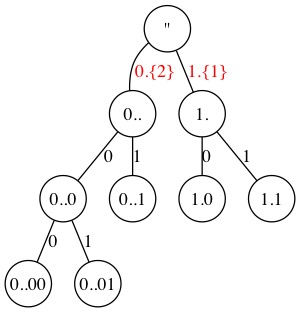
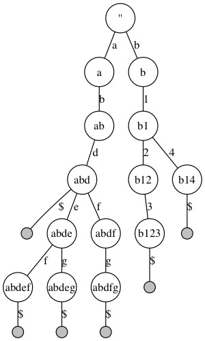
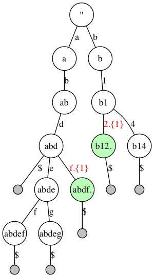
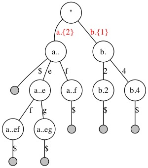
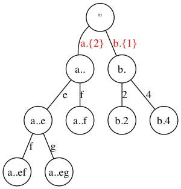

# Illustration of Reducing a Trie to SlimTrie

## Steps

### Bitrie

### Initialize Trie

### Reduce Leaf Nodes

### Reduce Inner Single Branch

### Remove Skip from Leaf Nodes

### Remove Leaf Nodes

## Update

Edit `.dot` files and `make clean; make`.

## Dependency

-   graphviz
