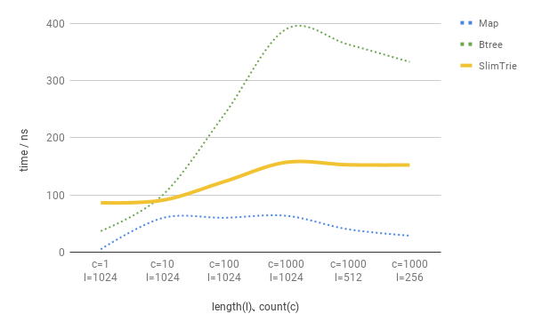

# Search performance comparison between trie, map and btree

## chart of search cost comparison

There are smooth line charts drew on the search cost data. The less time cost the better
performance.

1. comparison of searching existing key:

2. comparison of searching nonexistent key:

## search existing key between trie, map and btree:

| key length | key count | trie cost (ns) | map cost (ns) | btree cost (ns) |
| ---:       | ---:      | ---:           | ---:          | ---:            |
| 1024       | 1         | 86.367         | 5.037         | 36.933          |
| 1024       | 10        | 90.733         | 59.767        | 99.533          |
| 1024       | 100       | 123.333        | 60.100        | 240.667         |
| 1024       | 1000      | 157.000        | 63.567        | 389.667         |
| 512        | 1000      | 152.667        | 40.033        | 363.000         |
| 256        | 1000      | 152.333        | 28.833        | 332.333         |

## search nonexistend key between trie, map and btree:

| key length | key count | trie cost (ns) | map cost (ns) | btree cost (ns) |
| ---:       | ---:      | ---:           | ---:          | ---:            |
| 1024       | 1         | 60.267         | 10.900        | 92.567          |
| 1024       | 10        | 63.667         | 68.733        | 178.000         |
| 1024       | 100       | 100.066        | 71.699        | 297.333         |
| 1024       | 1000      | 134.667        | 68.833        | 441.667         |
| 512        | 1000      | 131.333        | 49.300        | 389.667         |
| 256        | 1000      | 136.333        | 38.300        | 362.667         |

## ratio of search cost with existing key between trie, map and btree:

| key length | key count | trie cost / map cost | trie cost / btree cost |
| ---:       | ---:      | ---:                 | ---:                   |
| 1024       | 1         | 1714.7 %             | 233.8 %                |
| 1024       | 10        | 151.8 %              | 91.2 %                 |
| 1024       | 100       | 205.2 %              | 51.2 %                 |
| 1024       | 1000      | 246.9 %              | 42.3 %                 |
| 512        | 1000      | 381.4 %              | 42.1 %                 |
| 256        | 1000      | 528.3 %              | 45.8 %                 |

## ratio of search cost with nonexistent key between trie, map and btree

| key length | key count | trie cost / map cost | trie cost / btree cost |
| ---:       | ---:      | ---:                 | ---:                   |
| 1024       | 1         | 552.9 %              | 65.1 %                 |
| 1024       | 10        | 92.6 %               | 35.8 %                 |
| 1024       | 100       | 139.6 %              | 33.7 %                 |
| 1024       | 1000      | 195.6 %              | 30.5 %                 |
| 512        | 1000      | 266.4 %              | 33.7 %                 |
| 256        | 1000      | 355.9 %              | 37.6 %                 |

## trie search cost of `less than`, `equal`, `greater than` keys at the same time

| key length | key count | existing key cost (ns) | nonexistent key cost (ns) |
| ---:       | ---:      | ---:                   | ---:                      |
| 1024       | 1         | 119.000                | 106.667                   |
| 1024       | 10        | 182.333                | 179.000                   |
| 1024       | 100       | 246.000                | 218.000                   |
| 1024       | 1000      | 260.667                | 238.000                   |
| 512        | 1000      | 262.000                | 238.333                   |
| 256        | 1000      | 248.667                | 207.667                   |

