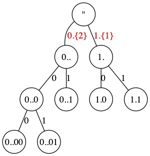
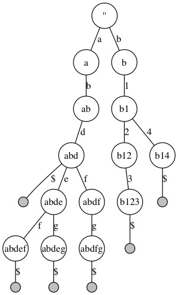
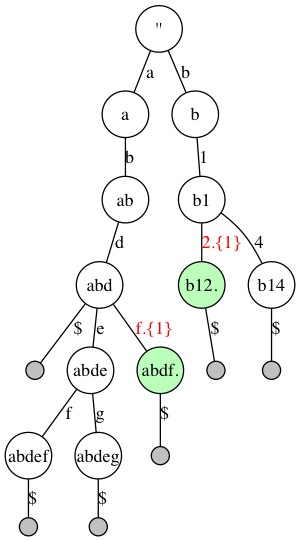
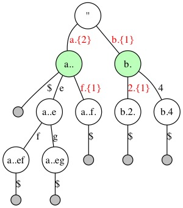
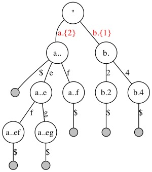
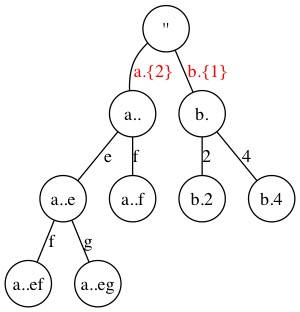

# Illustration of Reducing a Trie to SlimTrie

## Steps

### Bitrie



### Initialize Trie




### Reduce Leaf Nodes




### Reduce Inner Single Branch




### Remove Skip from Leaf Nodes




### Remove Leaf Nodes



## Update

```
cd imgs
```

Edit `.dot` files

```
make clean
make
```


## Dependency

-   graphviz
